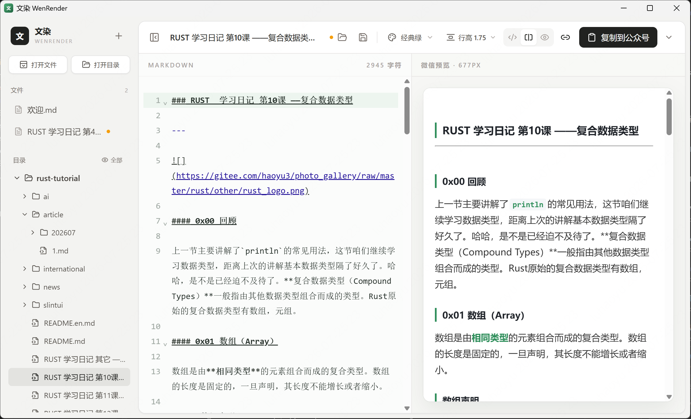

<div align="center">
  
  <h1>文染 WenRender</h1>
  <p>一款面向微信公众号写作与排版场景的本地 Markdown 编辑器。</p>
</div>

<div align="center">
  <a href="https://github.com/1595901624/WenRender/releases">
    
  </a>
  <a href="./LICENSE">
    
  </a>
  
  
  
</div>

## 软件界面



界面由三部分组成：

- 左侧为文件和目录树，可打开单个文件或整个项目目录。
- 中间为 Markdown 编辑器，支持语法高亮、自动换行和长文编辑。
- 右侧为微信公众号文章实时预览，预览宽度按照公众号常用正文宽度展示。

侧边栏可以通过顶部按钮或快捷键收起与展开。

## 主要功能

- 打开一个或多个 Markdown 文件。
- 打开完整目录并浏览多级目录树。
- 默认仅显示 Markdown 文件，也可以切换为显示全部文件。
- 使用 CodeMirror 6 提供 Markdown 编辑体验。
- 编辑内容时实时更新公众号文章预览。
- 编辑器与预览区域默认同步滚动。
- 支持单独显示编辑器、分栏显示和单独显示预览。
- 支持微信公众号兼容的静态代码高亮。
- 支持独立选择 Highlight.js 官方代码主题。
- 支持表格、引用、列表、图片、链接、行内代码和代码块。
- 支持调整正文与标题字体、字号、行高、段落间距和 H1～H6 标题层级。
- 排版设置按文章主题独立保存，并可随时恢复主题默认值。
- 支持亮色、暗色和跟随系统三种软件界面主题，默认跟随系统。
- 一键复制带内联样式的内容，可直接粘贴到公众号编辑器。
- 支持将完整文章导出为 HTML 文件。
- 自动恢复上次打开的文件、目录和最后编辑的文章。
- 自动保留未命名文章与尚未保存的编辑草稿。
- 保存时保留原文件的 `LF`/`CRLF` 换行符和 UTF-8 BOM。
- 定期检测磁盘文件的外部修改、删除和只读状态。
- 外部编辑冲突时提供版本比较、覆盖、重新加载与另存为。
- 通过临时文件和备份替换进行安全写入，保存失败时保留原文件。
- 关闭未保存的文档、目录或应用前进行保存确认。
- 自动记住主题、侧边栏和目录展开状态。
- 自动记住软件界面主题，并在“跟随系统”模式下实时响应系统主题变化。

## 内置主题

文染目前提供十款内置主题：

| 主题 | 适用场景 |
| --- | --- |
| 经典绿 | 技术教程与通用文章 |
| 极简黑白 | 长文阅读与简洁排版 |
| 深海科技 | 工程、编程与人工智能文章 |
| 暖杏手记 | 生活记录与个人随笔 |
| 胭脂人文 | 文化、历史与评论文章 |
| 紫雾灵感 | 产品、设计与创意内容 |
| 青瓷雅集 | 东方审美与人文内容 |
| 报刊铅字 | 深度报道与专栏文章 |
| 夜航代码 | 代码较多的技术文章 |
| 柠檬清单 | 清单、教程与科普内容 |

每款主题都拥有独立的字体、颜色、标题、引用、表格、代码块和图片样式。切换主题后，实时预览、公众号复制内容和导出的 HTML 会同时更新。

## 代码主题

文章主题和代码主题可以分别选择。文染目前内置八款 Highlight.js 官方代码主题：

- Atom 暗色
- GitHub 亮色
- GitHub 暗色
- Monokai
- 微软开发工具
- Nord 极夜
- 夜猫子
- 问答社区亮色

代码主题会实时应用到预览中的代码背景、关键字、类型、函数、字符串、数字和注释。所有颜色都会在生成文章时转换为内联样式，复制到微信公众号后不需要加载 Highlight.js 或外部样式表。

## 使用方法

### 打开文件

点击左侧的“打开文件”，可以一次选择一个或多个 Markdown 文件。打开的文件会显示在左侧“文件”区域。

### 打开目录

点击左侧的“打开目录”，选择一个项目目录。目录会以树形结构显示，子目录可以单独展开或收起。

目录视图默认仅显示 Markdown 文件以及包含 Markdown 文件的目录。点击“全部”后可以查看其他文件，但非 Markdown 文件不能在编辑器中打开。

### 编辑和预览

在中间编辑器中修改 Markdown 内容，右侧预览会实时刷新。同步滚动默认开启，可以通过顶部的链接按钮关闭。

顶部的视图按钮可以在以下模式之间切换：

- 仅显示编辑器。
- 编辑器和预览分栏显示。
- 仅显示预览。

### 软件设置

点击顶部的设置按钮，右侧主区域会切换到独立设置页面。设置页拥有单独的分类导航，后续可以继续增加编辑器、导出等设置。

软件主题提供“跟随系统”“亮色”和“暗色”三种模式，默认跟随系统。主题会应用于侧边栏、工具栏、菜单、设置页、Markdown 编辑器和软件弹窗；微信公众号文章预览使用所选文章主题，不随软件主题变化。

### 复制到公众号

完成排版后，点击右上角的“复制到公众号”，然后在微信公众号编辑器中粘贴。文染会复制已经转换为内联样式的 HTML，不需要公众号页面加载外部样式或脚本。

### 导出文章

点击“复制到公众号”右侧的下拉按钮，选择“导出 HTML”，可以保存一份完整的 HTML 文件。

### 保存与外部修改

黄色圆点表示当前文档存在尚未写入磁盘的修改。文染会自动备份编辑草稿，但默认不会自动覆盖原文件，需要使用顶部保存按钮或 `Ctrl/Cmd + S` 写入磁盘。

当文件被其它编辑器修改时：

- 当前文档没有本地修改：自动加载最新磁盘版本。
- 当前文档也有本地修改：暂停保存并显示两个版本，用户可以选择使用磁盘版本、覆盖磁盘、另存为或取消。
- 文件被删除：保留编辑器中的内容，可以重新创建原文件或另存为。

关闭包含未保存内容的文档、目录或整个应用时，会显示保存确认。保存采用临时文件与备份替换机制，写入成功后才会清除黄色圆点。

## 快捷键

| 快捷键 | 功能 |
| --- | --- |
| `Ctrl/Cmd + S` | 保存当前文章 |
| `Ctrl/Cmd + O` | 打开 Markdown 文件 |
| `Ctrl/Cmd + B` | 收起或展开侧边栏 |

## 本地开发

### 环境要求

开始前需要安装以下环境：

- Node.js 和 pnpm。
- Rust 稳定版工具链。
- Tauri 2 对应操作系统所需的系统依赖。

不同操作系统的依赖安装方式，请参考 [Tauri 2 环境准备说明](https://v2.tauri.app/zh-cn/start/prerequisites/)。

### 安装依赖

```bash
pnpm install
```

### 启动桌面应用

```bash
pnpm tauri dev
```

### 仅启动前端页面

```bash
pnpm dev
```

仅启动前端页面时，文件选择、目录扫描和本地文件读取等 Tauri 功能不可用。

### 检查前端构建

```bash
pnpm build
```

### 运行 Rust 测试

```bash
cargo test --manifest-path src-tauri/Cargo.toml
```

### 构建安装包

```bash
pnpm tauri build
```

构建产物会生成在 `src-tauri/target/release/bundle` 目录中。

## 项目结构

```text
WenRender
├─ demo                         演示图片
├─ src
│  ├─ components               编辑器、预览、侧边栏和排版面板组件
│  ├─ lib
│  │  ├─ document.ts           文档修改状态与换行符比较
│  │  ├─ markdown.ts           Markdown 与微信公众号 HTML 渲染
│  │  ├─ themes.ts             内置文章主题
│  │  ├─ typography.ts         文章排版覆盖参数与字体方案
│  │  └─ workspace.ts          工作区和草稿恢复
│  ├─ App.tsx                  应用状态与主要交互
│  └─ styles.css               应用界面公共样式
├─ src-tauri
│  ├─ capabilities             Tauri 权限配置
│  ├─ src                      Rust 目录扫描和文件读取逻辑
│  └─ tauri.conf.json          桌面应用配置
└─ README.md                   项目说明
```

## 数据与隐私

文染在本地读取和保存用户选择的文件，不会主动上传文章内容。

为了在软件重启后恢复工作区，应用会在本地 WebView 存储中保存以下信息：

- 用户打开过的文件和目录路径。
- 当前正在编辑的文件。
- 未命名文章和未保存的草稿。
- 主题、排版设置、侧边栏与目录展开状态。

如果原文件或目录已经移动、删除或无法读取，启动时会自动跳过对应路径，不影响其他工作区内容恢复。

## 开源协议

本项目按照 GNU Affero 通用公共许可证第 3 版发布，完整条款请查看 [LICENSE](LICENSE)。
